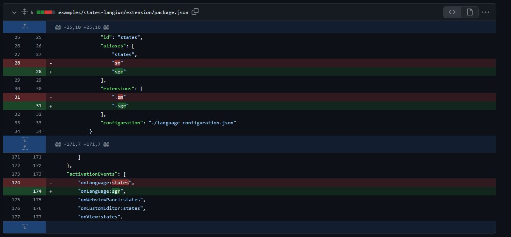
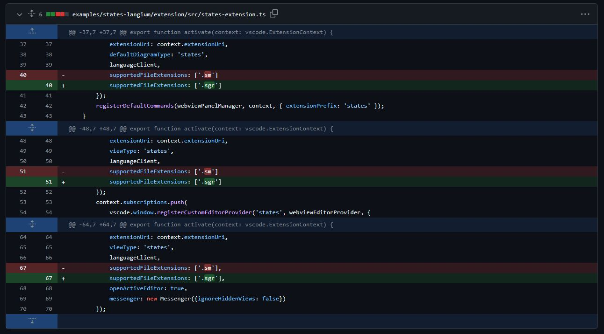
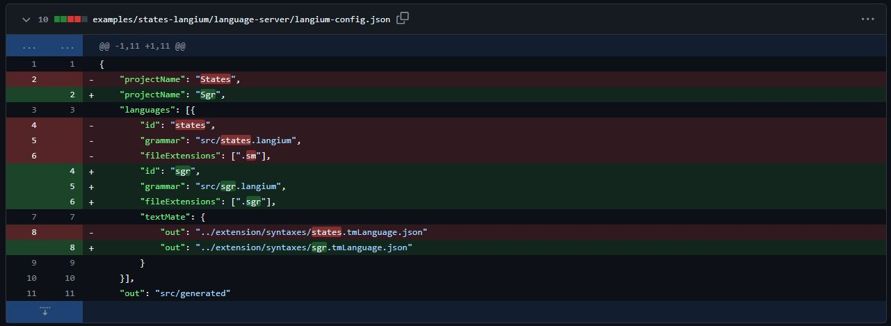
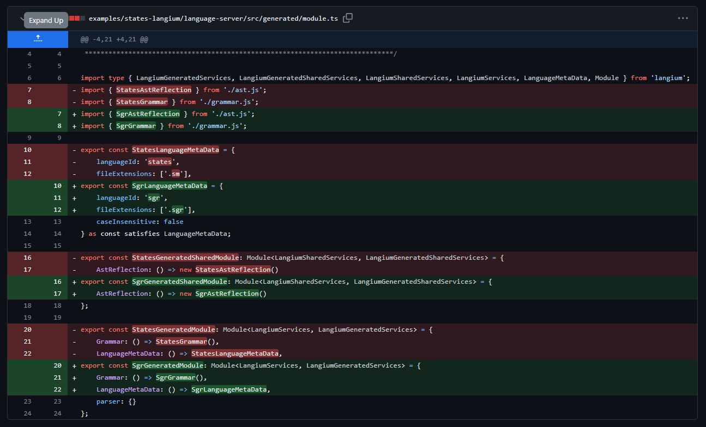
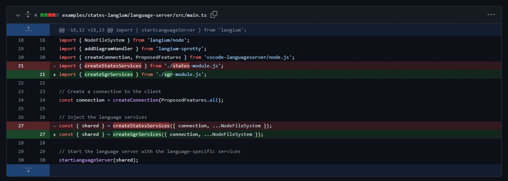

# usage

list of files to modifiy and adapt a new langage on sprotty-vscode

# files to move from Langium Project

file : [/examples/states-langium/extension/syntaxes/sgr.tmLanguage.json](../examples/states-langium/extension/syntaxes/sgr.tmLanguage.json)

file : [examples/states-langium/language-server/src/generated/ast.ts](../examples/states-langium/language-server/src/generated/ast.ts)

file : [examples/states-langium/language-server/src/generated/grammar.ts](../examples/states-langium/language-server/src/generated/grammar.ts)

file : [examples/states-langium/language-server/src/sgr-module.ts](../examples/states-langium/language-server/src/sgr-module.ts)

file [examples/states-langium/language-server/src/sgr-validator.ts](../examples/states-langium/language-server/src/sgr-validator.ts)

file : [examples/states-langium/language-server/src/sgr.langium](../examples/states-langium/language-server/src/sgr.langium)

# files to modify

file : [package.json](../examples/states-langium/extension/package.json)

file : [states-extension.ts](../examples/states-langium/extension/src/states-extension.ts)

file : [langium-config.json](../examples/states-langium/language-server/langium-config.json)

file : [states-extension.ts](../examples/examples/states-langium/extension/src/states-extension.ts)

file : [module.ts](../examples/states-langium/language-server/src/generated/module.ts)

file : [main.ts](../examples/states-langium/language-server/src/main.ts)

# custom file

file : [examples/states-langium/language-server/src/diagram-generator.ts](../examples/states-langium/language-server/src/diagram-generator.ts)
